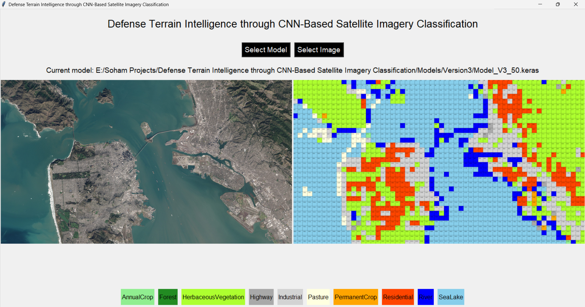

# Defense Terrain Intelligence through CNN-Based Satellite Imagery Classification

## Demo Video

👉 [Click here to watch the project demo video]([https://youtu.be/7kphF2olIks?si=LUfPFst6LnwKULyW])


## Overview

This project demonstrates the classification of satellite images using a custom Convolutional Neural Network (CNN). The model is tailored for defense-focused applications, such as strategic terrain assessment and surveillance. It classifies images from the EuroSAT dataset into ten distinct land-use classes, which are highly relevant for defense planning and situational awareness.

<p align="center"></p>

## Table of contents
1. [Introduction](#introduction)
2. [Dataset](#dataset)
3. [Methodology](#methodology)
   - [Data preprocessing](#data-preprocessing)
   - [Model training](#model-training)
   - [Model evaluation](#model-evaluation)
   - [Optimizing model performance](#optimizing-model-performance)
4. [Results](#results)
5. [Conclusion](#conclusion)
6. [Future work](#future-work)
7. [Installation](#installation)
8. [Usage](#usage)
9. [Model architecture](#model-architecture)
10. [Contact](#contact)

## Introduction

Satellite image classification plays a crucial role in defense applications such as border surveillance, terrain monitoring, and strategic planning. This project leverages deep learning, particularly CNNs, to classify satellite images into ten categories: AnnualCrop, Forest, HerbaceousVegetation, Highway, Industrial, Pasture, PermanentCrop, Residential, River, and SeaLake — all of which are vital for military terrain intelligence.

## Dataset

The EuroSAT dataset, which comprises 27,000 labeled images of various land use and land cover types, is used for this project. The images are 64x64 pixels and categorized into the following classes:
- AnnualCrop
- Forest
- HerbaceousVegetation
- Highway
- Industrial
- Pasture
- PermanentCrop
- Residential
- River
- SeaLake

<p align="center">
   
   
   
   
   
   
   
   
   
   
</p>

## Methodology

### Data Preprocessing

1. **Normalization**: Pixel values are scaled to the range [0, 1].
2. **Tensor conversion**: Images are converted to tensors.
3. **One-Hot encoding**: Labels are transformed into one-hot encoded vectors.
4. **Dataset splitting**: The dataset is divided into training, validation, and test sets.
5. **Data augmentation**: Techniques such as random flips and brightness adjustments are applied to enhance model robustness.

### Model training

Three versions of the model were trained with different configurations to identify the optimal training parameters. The models were trained using:
- **Optimizer**: Stochastic Gradient Descent (SGD) with momentum
- **Loss function**: Categorical cross-entropy
- **Class weights adjustment**: To handle class imbalance
- **Learning rate scheduler**: Step decay function to adjust the learning rate
- **Early stopping**: To prevent overfitting

### Model evaluation

The model was evaluated on the test dataset using metrics such as accuracy and confusion matrices to assess its performance and generalization ability.

### Optimizing model performance

Three different configurations were tested to determine the best model. The best model achieved a classification accuracy of 96% on the test dataset.

## Results

### Predictions
<p align="center">
   
</p>

<p align="center">
  
</p>
<p align="center">
  
</p>
<p align="center">
  
</p>


## Conclusion

This project demonstrates the effectiveness of CNNs in satellite image classification, particularly for defense-focused terrain intelligence. The custom **SpectrumNet** architecture achieved high accuracy, highlighting the importance of meticulous data preprocessing, robust training strategies, and detailed performance evaluation.

## Future work

Future improvements could include:
- Using higher resolution images to capture more detailed features
- Exploring advanced neural network architectures
- Implementing transfer learning techniques
- Expanding the dataset through advanced augmentation or synthetic data generation
- Integrating multi-temporal or multi-spectral satellite data for richer defense analytics

## Installation

1. Clone the repository:
    ```bash
    git clone https://github.com/sohamkhanna08/Satellite-Imagery-CNN-Defense.git

    cd Satellite-Imagery-CNN-Defense
    ```

2. Install the required packages:
    ```bash
    pip install -r requirements.txt
    ```

## Usage
### Use the GUI for classification

To use the graphical interface for classifying satellite images:

1. Run the GUI application:
    ```bash
    python classifierApp.py
    ```

2. **Select a Model**: Click on the "Select Model" button and choose the trained model file (`.keras`).

3. **Select an Image**: Once a model is loaded, click on the "Select Image" button and choose the satellite image you want to classify.

4. **View Results**: The application will display the original image and the colorized classification map. You can select a different image to classify or load a new model to use for classification.

<p align="center">
   
</p>

## Model architecture

A custom CNN architecture named SpectrumNet was designed, consisting of multiple convolutional and spectral blocks to capture multi-scale features from the input images. The architecture leverages Batch Normalization and ReLU activation to stabilize and accelerate training. This model was optimized with defense-specific terrain recognition tasks in mind.

<p align="center"></p>

## Contact

For questions, feedback, or collaboration:
**Soham Khanna**  
[LinkedIn - Soham Khanna](https://www.linkedin.com/in/sohamkhanna)  
[GitHub - Soham Khanna](https://github.com/sohamkhanna08)

---

This project demonstrates the potential of deep learning in remote sensing and defense applications, and provides a robust foundation for future advancements in satellite-based terrain intelligence systems.
